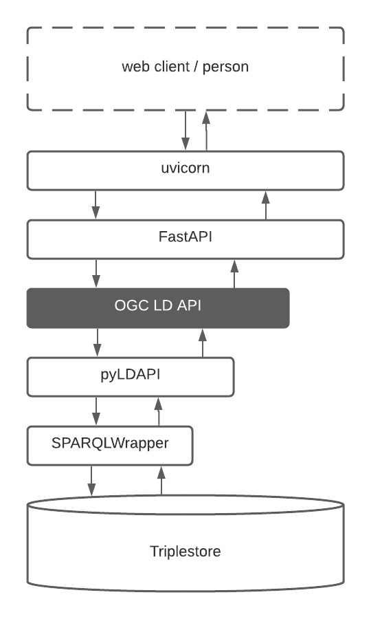

# OGC Linked Data API
An implementation of the [Open Geospatial Consortium's (OGC)](https://www.ogc.org) [_Features_ API Core](http://www.opengis.net/doc/IS/ogcapi-features-1/1.0).

This API framework uses [Linked Data](https://www.w3.org/standards/semanticweb/data) mechanisms, in particular [_Content Negotiation by Profile_](https://w3c.github.io/dx-connegp/connegp/), to deliver human- and machine-readable data over the internet in several forms, including according to the OGC _Features_ API. This is possible because the OGC _Features_ API requires HTML and (Geo)JSON content for _Features_, _Feature Collections_, _Geometries_ and so on, all of which can be represented as Linked Data via use of the OGC's [GeoSPARQL 1.1 Specification](https://opengeospatial.github.io/ogc-geosparql/geosparql11/spec.html).


## API Structure
This API is a pure-Python API that implements a fixed structure matching that of the OGC _Features_ API structure with a _landing page_, lists of _Feature Collections_ and items (_Features_) within those collections. 

**Endpoint** | **API Path**
--- | ---
Landing Page | `/`
Feature Collections | `/collections`
Collection X | `/collections/X`
Items in Collection X | `/collections/X/items`
Item Y in Collection X | `/collections/X/items/Y`

It also provides expected OpenAPI endpoints for API descriptions and a SPARQL Endpoint for graph structure equrying.

**Endpoint** | **API Path**
--- | ---
OpenAPI Specification in JSON | `/spec`
Auto-generated OpenAPI interactive HTML | `/docs`
Conformance class listing | `/conformance`
SPARQL endpoint | `/sparql`

### Back-end
The API issues all requests for data to a separate RDF database
("triplestore") back-end. This is similar to issuing queries to any other database, such as a PostGres relationa DB. Figure 1 shows the main Python and back-end stack.

<br />
**Figure 1**: OGC LDAPI system overview  


### Python Dependencies
Conceptually, there are three main areas of functional dependency in this API:

1. Spatial
2. RDF (Linked Data)
3. FastAPI

_Spatial_ includes packages such as `geojson-rewind` & `geomet` that do some small spatial data handling.

_RDF_ includes `rdflib` & `SPARQLWrapper` which are used to either parse or serialise RDF data (the first) or interact with an RDF database (a 'rtiplestore') (the latter).

_FastAPI_ includes packages related to the [FastAPI](https://fastapi.tiangolo.com/) web framework such as `fastapi`, `starlette` & `uvicorn`.


## Installation
All the dependencies are available via the Python Package Index, PyPI, so you can "pip install" everything needed to run this API into a Python environment like this:

```bash
pip install -r app/requirements.txt
```

## Use
There are a number of deployment patterns that can be used for FastAPI systems, we use the [uvicorn](https://www.uvicorn.org/) Python web server.

We run this API both locally for testing and in production using `uvicorn`. All you really have to do is set a couple of environment variables and run the API instance via a single `uvicorn` call.

### Environment variables
All environment variables except `SPARQL_ENDPOINT` are optional in that defaults often work. See `config.py` for the defaults.

Typically you might set these variables:

**Variable** | **Purpose**
--- | ---
`SPARQL_ENDPOINT` | The location of the RDF database
`SPARQL_USERNAME` | Username for above
`SPARQL_PASSWORD` | Password for above
&nbsp; | &nbsp;
`DATASET_URI` | The identifier of the Dataset in the RDF database for this API's data (the DB may contain lots of other stuff)
`LANDING_PAGE_URL` | The home page of this API. This may be left unset if the API is proxied to.
&nbsp; | &nbsp;
`API_TITLE` | A custom title for the API, displayed on many pages
`HEADER` | The URL of an online-accessible [Jinja2](https://pypi.org/project/Jinja2/) template for the header of each page. See `app/templates/header_template.html`. The API will pull this in on load so the template should be in something like GitHub.
`FOOTER` | As above, for a footer
`STYLESHEET` | A stylsheet for the API, as a file refered to via URL.


### Simple, local
 Locally, this just involves running a command list this:

```
uvicorn app:api --host 0.0.0.0 --port 9000
```

### Docker
The `Dockerfile` supplied in this repo can build a Docker image that you can use to run this API in any Docker container system. We use Kubernetes on AWS.


## Tests
Instances of this API are best tested with two sets of independent tests:

1. OGC API conformance tests
2. Content Negotiation by Profile (Linked Data) conformance tests

SURROUND maintains libraries of these tests and they will be published soon, and linked to from here.

You may also use other OGC API test suites.


## Data
For [RDF](https://www.w3.org/RDF/) data to work with this API, it must be valid according to the [OGC LD API Profile](https://w3id.org/profile/ogcldapi) which is a standard requiring the data to have certain things, such as a `dcat:Dataset` declaration, `geo:FeatureCollection` instances and so on. 

The profile provides bothe written requirements (the "[Specification](https://w3id.org/profile/ogcldapi/spec)") as well as a [SHACL](https://www.w3.org/TR/shacl/) data [validator](https://w3id.org/profile/ogcldapi/validator) that can be used to automatically test data.

If your data passes all the validator tests, it ***will*** work with the API!

## Assistance
This open source API and instances of it are commercially supported by the creator, [SURROUND Australia Pty Ltd](https://surroundaustralia.com). Please contact SURROUND, via the _Contact_ section below, for any help!

You can also log Issues in the Issue tracker of this repo:

* <https://github.com/surroundaustralia/ogcldapi/issues>


## License  
This code is licensed using the Apache licence. See the [LICENSE file](LICENSE) for the deed. 

Note [Citation](#citation) below for attribution.


## Citation
To cite this software, please use the following BibTex:

```
@software{surroundaustralia/ogcldapi,
  title = {OGC Linked Data API},
  version = {1.2},
  date = {2021},
  publisher = "SURROUND Australia Pty. Ltd.",
  url = {https://github.com/surroundaustralia/ogcldapi}
}
```


## Contact
*publisher:*  
  
**SURROUND Australia Pty. Ltd.**  
<https://surroundaustralia.com>  
<info@surroundaustralia.com>  
